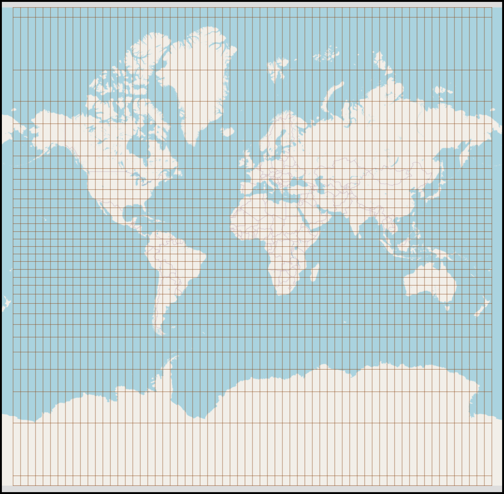

# Sistema de Coordenadas BGrid



## Web para su testeo: https://bgrid.org

## Resumen

Presentamos un nuevo sistema de coordenadas denominado "BGrid" diseñado para referenciar ubicaciones en la superficie terrestre mediante divisiones jerárquicas. El sistema divide recursivamente la superficie terrestre en 2048 parcelas por nivel, alcanzando una precisión de hasta 29 m². Una característica distintiva es la alternancia en los factores de división entre longitud y latitud para obtener áreas más homogéneas, así como la posibilidad de representar las coordenadas mediante palabras del estándar BIP39, facilitando su memorización y comunicación verbal.

## 1. Introducción

Los sistemas de coordenadas geográficas tradicionales como las coordenadas decimales (DD) o las coordenadas UTM presentan ciertas limitaciones en cuanto a su facilidad de comunicación verbal, memorización y precisión variable. El sistema BGrid ofrece una alternativa que permita:

1. Referenciar zonas geográficas con distintos niveles de precisión según las necesidades.
2. Facilitar la comunicación verbal y escrita de coordenadas mediante el uso opcional de palabras.
3. Mantener una distribución relativamente equitativa del área de las parcelas en diferentes latitudes.
4. Implementar un sistema compatible con tecnologías modernas de cifrado y almacenamiento de información.

## 2. Fundamentos del Sistema BGrid

### 2.1 Estructura Jerárquica

El sistema BGrid divide la superficie terrestre en 2048 parcelas iniciales (nivel 1), y cada una de estas parcelas puede subdividirse nuevamente en 2048 parcelas más pequeñas (nivel 2), y así sucesivamente hasta alcanzar el nivel 4 de precisión. Esto resulta en un total potencial de 2.048⁴ parcelas en el nivel más detallado.

### 2.2 Alternancia de Divisiones

Para corregir la distorsión que se produce en los sistemas de coordenadas tradicionales, donde las celdas se vuelven más estrechas cerca de los polos, BGrid implementa una alternancia en los factores de división:

- En niveles pares: la longitud se divide en 32 partes y la latitud en 64 partes
- En niveles impares: la longitud se divide en 64 partes y la latitud en 32 partes

Esta alternancia produce parcelas más próximas a un cuadrado en diferentes latitudes.

### 2.3 Representación de Coordenadas

Las coordenadas BGrid se representan mediante una serie de hasta cuatro números separados por comas, donde cada número corresponde al identificador de la parcela en su respectivo nivel:

```
N₁,N₂,N₃,N₄
```

Donde:
- N₁: Identificador de la parcela de nivel 1 (entre 1 y 2.048)
- N₂: Identificador de la parcela de nivel 2 (entre 1 y 2.048) dentro de N₁
- N₃: Identificador de la parcela de nivel 3 (entre 1 y 2.048) dentro de N₂
- N₄: Identificador de la parcela de nivel 4 (entre 1 y 2.048) dentro de N₃

### 2.4 Precisión por Nivel

Considerando una superficie terrestre aproximada de 510.000.000 km², la precisión por nivel es:

- Nivel 1: 510.000.000 / 2.048 = 249.023,44 km²
- Nivel 2: 510.000.000 / 2.048² = 121,59 km²
- Nivel 3: 510.000.000 / 2.048³ = 0,059 km² (59.371 m²)
- Nivel 4: 510.000.000 / 2.048⁴ = 0,000029 km² (29 m²)

## 3. Formulación Matemática

### 3.1 Proceso de Codificación (Coordenadas DD a BGrid)

Para convertir las coordenadas decimales tradicionales (latitud, longitud) a coordenadas BGrid, se utiliza el siguiente algoritmo:

#### 3.1.1 Normalización de coordenadas

Primero, normalizamos las coordenadas de entrada para obtener valores entre 0 y 1:

Para la longitud:
$$x = \frac{\text{lon} + 180}{360}$$

Para la latitud:
$$y = \frac{\text{lat} + 90}{180}$$

Donde:
- lon: longitud decimal en el rango [-180, 180]
- lat: latitud decimal en el rango [-90, 90]
- x: longitud normalizada en el rango [0, 1]
- y: latitud normalizada en el rango [0, 1]

#### 3.1.2 Cálculo de índice para cada nivel

Para determinar el índice de la parcela en cada nivel (N₁, N₂, N₃, N₄), aplicamos iterativamente:

Para el nivel i (donde i va de 1 a 4):

Si i es impar:
$$D_{\text{lon}} = 64$$
$$D_{\text{lat}} = 32$$

Si i es par:
$$D_{\text{lon}} = 32$$
$$D_{\text{lat}} = 64$$

Donde $$D\_{\text{lon}}$$ y $$D\_{\text{lat}}$$ son los factores de división para longitud y latitud respectivamente.

Luego calculamos:
$$\text{col}\_i = \lfloor x \cdot D\_{\text{lon}} \rfloor$$
$$\text{fila}\_i = \lfloor y \cdot D\_{\text{lat}} \rfloor$$
$$N\_i = \text{fila}\_i \cdot D\_{\text{lon}} + \text{col}\_i$$

Y actualizamos las coordenadas normalizadas para el siguiente nivel:
$$x = \frac{x \cdot D\_{\text{lon}} - \text{col}\_i}{1}$$
$$y = \frac{y \cdot D\_{\text{lat}} - \text{fila}\_i}{1}$$

### 3.2 Proceso de Decodificación (BGrid a Coordenadas DD)

Para convertir coordenadas BGrid a coordenadas decimales, utilizamos el siguiente algoritmo:

#### 3.2.1 Inicialización

Comenzamos con los rangos completos de longitud y latitud:
- Rango de longitud: [-180, 180]
- Rango de latitud: [-90, 90]

#### 3.2.2 Refinamiento por nivel

Para cada nivel i (de 1 a n, donde n es el número de niveles proporcionados en la coordenada BGrid):

Si i es impar:
$$D_{\text{lon}} = 64$$
$$D_{\text{lat}} = 32$$

Si i es par:
$$D_{\text{lon}} = 32$$
$$D_{\text{lat}} = 64$$

Calculamos la fila y columna a partir del índice Ni:

```math
\text{col}_i = N_i \bmod D_{\text{lon}}
```

```math
\text{fila}_i = \lfloor N_i / D_{\text{lon}} \rfloor
```

Actualizamos los rangos de coordenadas:

```math
\text{ancholon} = \frac{\text{maxlon} - \text{minlon}}{D_{\text{lon}}}
```

```math
\text{altolat} = \frac{\text{maxlat} - \text{minlat}}{D_{\text{lat}}}
```

```math
\text{minlon} = \text{minlon} + \text{col}_i \cdot \text{ancholon}
```

```math
\text{maxlon} = \text{minlon} + \text{ancholon}
```

```math
\text{minlat} = \text{minlat} + \text{fila}_i \cdot \text{altolat}
```

```math
\text{maxlat} = \text{minlat} + \text{altolat}
```

#### 3.2.3 Cálculo de coordenadas finales

Una vez procesados todos los niveles, las coordenadas decimales (lat, lon) del centro de la parcela son:

```math
\text{lon} = \frac{\text{minlon} + \text{maxlon}}{2}
```

```math
\text{lat} = \frac{\text{minlat} + \text{maxlat}}{2}
```

## 4. Representación Mnemotécnica mediante BIP39

### 4.1 Fundamentos de BIP39

BIP39 (Bitcoin Improvement Proposal 39) define un estándar para generar frases mnemotécnicas a partir de números mediante una lista de 2.048 palabras. Este estándar fue diseñado originalmente para representar claves de billeteras de criptomonedas de manera recordable.

### 4.2 Aplicación en BGrid

Cada índice de parcela (N₁, N₂, N₃, N₄) puede ser convertido a su palabra correspondiente en la lista BIP39:

$$\text{palabra}_i = \text{BIP39}[N_i]$$

Donde BIP39[n] devuelve la palabra en la posición n de la lista BIP39 (valores de 1 a 2.048).

Por ejemplo, una coordenada BGrid '1045,45,123,319' podría representarse como:
"llover,agonía,apetito,calle"

### 4.3 Ventajas Multilingües

El estándar BIP39 está disponible en múltiples idiomas, permitiendo la representación de coordenadas BGrid en el idioma preferido del usuario. Por ejemplo, la misma coordenada anterior podría representarse en inglés como:
"little,airport,aunt,chief"

## 5. Análisis Comparativo con Otros Sistemas

### 5.1 Comparación con Coordenadas Decimales (DD)

| Característica | BGrid | Coordenadas Decimales |
|----------------|---------|------------------------|
| Precisión máxima | 29 m² | Variable según decimales |
| Facilidad de comunicación verbal | Alta (usando palabras BIP39) | Baja |
| Estructura jerárquica | Sí | No |
| Niveles de precisión | 4 niveles definidos | Indefinido (depende de decimales) |
| Distorsión en altas latitudes | Corregida parcialmente | Alta |

### 5.2 Comparación con Otros Sistemas Jerárquicos

| Característica | BGrid | Geohash | What3Words |
|----------------|---------|---------|------------|
| Base numérica | 2.048 | 32 | N/A |
| Precisión máxima | 29 m² | Variable | 9 m² |
| Apertura del sistema | Abierto | Abierto | Propietario |
| Compatibilidad con criptografía | Alta | Media | Baja |
| Distribución de áreas | Adaptativa | Fija | Fija |

## 6. Aplicaciones Prácticas

### 6.1 Geolocalización con Privacidad Variable

El sistema BGrid permite compartir ubicaciones con diferentes niveles de precisión según los requisitos de privacidad:

- Nivel 1: Útil para indicar regiones extensas (aproximadamente 250.000 km²)
- Nivel 2: Adecuado para áreas metropolitanas o comarcas (122 km²)
- Nivel 3: Precisión suficiente para localizar barrios o zonas específicas (59.371 m²)
- Nivel 4: Precisión para localizar edificios específicos (29 m²)

### 6.2 Integración con Sistemas Blockchain

La compatibilidad con BIP39 facilita la integración de BGrid en aplicaciones criptográficas para registros de propiedad, certificación de ubicación o pruebas de localización.

### 6.3 Comunicación Verbal de Coordenadas

La capacidad de representar coordenadas como palabras facilita:
- Dictado telefónico de ubicaciones
- Memorización de lugares importantes
- Reducción de errores en la transmisión verbal de ubicaciones

## 7. Implementación

### 7.1 Algoritmo en Pseudocódigo para Codificación

```
función coordenadasABGrid(latitud, longitud, niveles):
    // Normalización de coordenadas
    x = (longitud + 180) / 360
    y = (latitud + 90) / 180
    
    resultado = []
    
    para i de 1 a niveles:
        si i es impar:
            divisorLon = 64
            divisorLat = 32
        sino:
            divisorLon = 32
            divisorLat = 64
        
        columna = entero(x * divisorLon)
        fila = entero(y * divisorLat)
        
        // Cálculo de índice
        índice = fila * divisorLon + columna
        añadir índice a resultado
        
        // Actualización para siguiente nivel
        x = (x * divisorLon - columna)
        y = (y * divisorLat - fila)
    
    retornar resultado unidos por comas
```

### 7.2 Algoritmo en Pseudocódigo para Decodificación

```
función bgridACoordenadas(coordBGrid):
    // Separar los niveles
    niveles = separarPorComas(coordBGrid)
    
    // Inicializar rangos
    minLon = -180
    maxLon = 180
    minLat = -90
    maxLat = 90
    
    para i de 1 a longitud(niveles):
        índice = niveles[i]
        
        si i es impar:
            divisorLon = 64
            divisorLat = 32
        sino:
            divisorLon = 32
            divisorLat = 64
        
        // Calcular fila y columna
        columna = índice mod divisorLon
        fila = entero(índice / divisorLon)
        
        // Actualizar rangos
        anchoLon = (maxLon - minLon) / divisorLon
        altoLat = (maxLat - minLat) / divisorLat
        
        minLon = minLon + columna * anchoLon
        maxLon = minLon + anchoLon
        minLat = minLat + fila * altoLat
        maxLat = minLat + altoLat
    
    // Calcular el centro de la parcela final
    longitud = (minLon + maxLon) / 2
    latitud = (minLat + maxLat) / 2
    
    retornar [latitud, longitud]
```

## 8. Conclusiones

El sistema de coordenadas BGrid ofrece una alternativa innovadora a los sistemas tradicionales, con especial énfasis en la usabilidad, la comunicación verbal y la adaptabilidad a diferentes necesidades de precisión. Su integración con el estándar BIP39 facilita la memorización y transmisión de ubicaciones geográficas, mientras que su estructura jerárquica permite ajustar la precisión según los requisitos de cada aplicación.

La alternancia en los factores de división entre niveles contribuye a mantener una forma más cuadrada de las parcelas, lo que mitiga parcialmente la distorsión inherente a la proyección de una superficie esférica en un sistema de coordenadas rectangular.

## Referencias

1. Bitcoin Improvement Proposal 39 (BIP39): [https://github.com/bitcoin/bips/blob/master/bip-0039.mediawiki](https://github.com/bitcoin/bips/blob/master/bip-0039.mediawiki)
2. Sistemas de coordenadas geográficas. Instituto Geográfico Nacional.
3. Sahr, K., White, D., & Kimerling, A. J. (2003). Geodesic discrete global grid systems. Cartography and Geographic Information Science, 30(2), 121-134.
4. What3Words: Un sistema alternativo de codificación geográfica. [https://what3words.com/about](https://what3words.com/about)
5. Geohash: Sistema de geocodificación público. [https://en.wikipedia.org/wiki/Geohash](https://en.wikipedia.org/wiki/Geohash)

## 9. Licencia
Apache 2.0  
http://www.apache.org/licenses/
